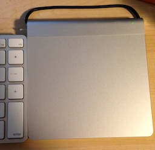
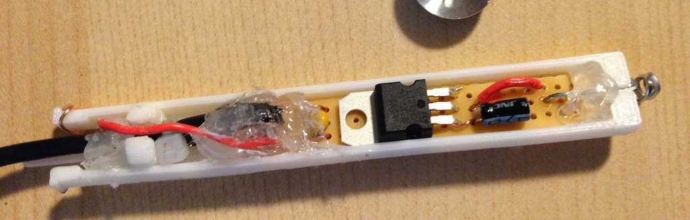
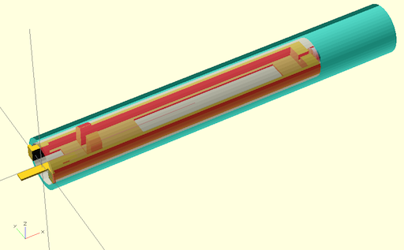
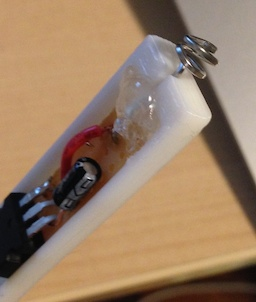
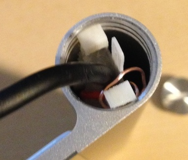
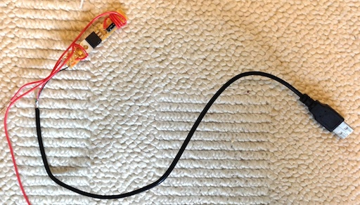
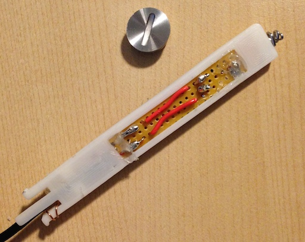

# Trackpad USB Power

**Replace batteries in the magic trackpad with USB power**

## Overview

Tired of changing batteries in a wireless peripheral that never moves from your desk? So am I (and so are [others](http://hackaday.com/2010/08/19/replace-batteries-with-usb-power/)).

This project uses a [basic LD1117V33 voltage regulator](https://www.sparkfun.com/products/526) circuit, half of a USB cable, some wires, and a 3D-printed frame to replace the 2 AA batteries in the Apple Magic Trackpad. It can be accomplished in an afternoon. 

## Circuit

To accomplish this project in general, you need to convert the 5V power from your keyboard's USB port to something near the 3V that 2 AA batteries supply. You could do [no conversion at all](http://hackaday.com/2010/08/19/replace-batteries-with-usb-power/), but you risk damaging the trackpad. 

There are many ways to convert the voltage, but I already had a 3.3V regulator. The circuit is simply the same as the one in the [datasheet](https://www.sparkfun.com/datasheets/Components/LD1117V33.pdf), which calls for a 100nF capacitor on the input and a 10μF capacitor on the output. 

The circuit was first tested on a breadboard with a multimeter. Then I soldered the circuit to the breadboard with long wires attached for the +/- terminals. I tested those in the trackpad by taping the ends to a pen and holding them in place. With the trackpad powering up that way, I was able to move on to the frame. 

## Frame

A 3D-printed frame is used to hold everything in place. You can attach the circuit many other ways, including some that would be permanent. This frame has tabs on the end that screw into the threads of the battery compartment. 

### Design Process

To create a bracket that will hold or fit into something, start by modeling the things it will hold or fit into. In this case, that's the battery compartment and the circuit board. 

Once you have those building blocks in place, you can start with a simple cube shape for the frame and subtract away the shape of the compartment and the circuit board. 

It's also worthwhile to make all of the objects parametric so that you can adjust variables that might depend on the performance of your 3D printer. 

Here's the definition of the frame: 

	module frame() {
	  difference() {
	    union() {
		  translate([0,-inner_slot_d/2,-frame_h/2])
	      cube([inner_slot_l, inner_slot_d, frame_h]);
	    };
	    frame_cutout_for_board(); // space for the circuit board
	    frame_cutout_for_board_bottom(); // space for stuff below the board
	    spring_cutout(); // a notch for the paperclip
		slot(); // the battery compartment
	  }
	}

I measured the inner diameter of the battery compartment to be 15mm, so `inner_slot_d` was initially set to 15. However, the actual size of your 3D print will vary based on your printer and slicer settings. I found that setting the inner_slot_d to 14 gave me the best fit. You'll have to make adjustments like that depending on the type of wire you use for the positive terminal and how you provide strain relief for the USB cable. 

Here's the [OpenSCAD source](trackpad-usb-power.scad) and the [STL file](trackpad-usb-power.stl) used for the print. 

## Connection

The positive "terminal" of the unit is a paperclip that's bent into a spring. 

The negative side needs to make contact with the *inside* of the threads at the opening of the battery compartment, so the ground wire is wrapped around one of the tabs that holds the assembly in place. 

## USB cable

I chose to use a longer section of USB cable because the one I had available to sacrifice was relatively stiff, so it couldn't make the sharp bend from the battery compartment to my keyboard without pushing the trackpad away from the keyboard. If you use a thinner cable with a smaller plug, you can make the cable much shorter. 

You just need the power wires from the USB cable and can clip the signal wires. Use a multimeter to determine which wire is which. In this photo of the work in progress, the leads are just soldered on for testing. 

In the final assembly, the leads are cut shorter and soldered to the bottom of the board. 

Strain relief is provided by a set of tabs in the frame and a zip tie around the cable. 

## Assembly

Everything is held in place with hot glue, of course. 
